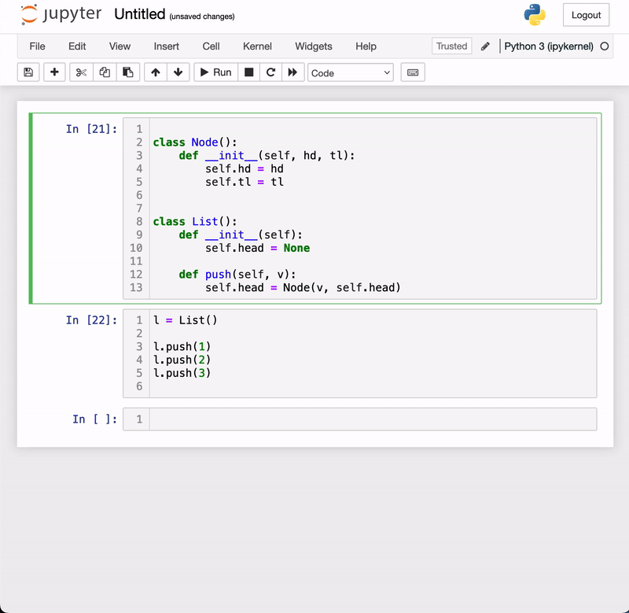

# dsvisualizer

[](https://travis-ci.org/romero-jose/dsvisualizer)
[](https://codecov.io/gh/romero-jose/dsvisualizer)


A simple data structure visualizer for Jupyter Notebooks.

## Usage

To visualize your linked list implementation import the library and add the corresponding decorators to the linked list node and container.



## Installation

You can install using `pip`:

```bash
pip install dsvisualizer
```

<details>
<summary>If using Google Colab</summary>

You need to run the following snippet to enable custom widgets.

```py
from google.colab import output
output.enable_custom_widget_manager()
```
</details>

## Development Installation

Create a dev environment:
```bash
conda create -n dsvisualizer-dev -c conda-forge nodejs yarn python jupyterlab
conda activate dsvisualizer-dev
```

Install the python. This will also build the TS package.
```bash
pip install -e ".[test, examples]"
```

When developing your extensions, you need to manually enable your extensions with the
notebook / lab frontend. For lab, this is done by the command:

```
jupyter labextension develop --overwrite .
yarn run build
```

For classic notebook, you need to run:

```
jupyter nbextension install --sys-prefix --symlink --overwrite --py dsvisualizer
jupyter nbextension enable --sys-prefix --py dsvisualizer
```

Note that the `--symlink` flag doesn't work on Windows, so you will here have to run
the `install` command every time that you rebuild your extension. For certain installations
you might also need another flag instead of `--sys-prefix`, but we won't cover the meaning
of those flags here.

### How to see your changes
#### Typescript:
If you use JupyterLab to develop then you can watch the source directory and run JupyterLab at the same time in different
terminals to watch for changes in the extension's source and automatically rebuild the widget.

```bash
# Watch the source directory in one terminal, automatically rebuilding when needed
yarn run watch
# Run JupyterLab in another terminal
jupyter lab
```

After a change wait for the build to finish and then refresh your browser and the changes should take effect.

#### Python:
If you make a change to the python code then you will need to restart the notebook kernel to have it take effect.
